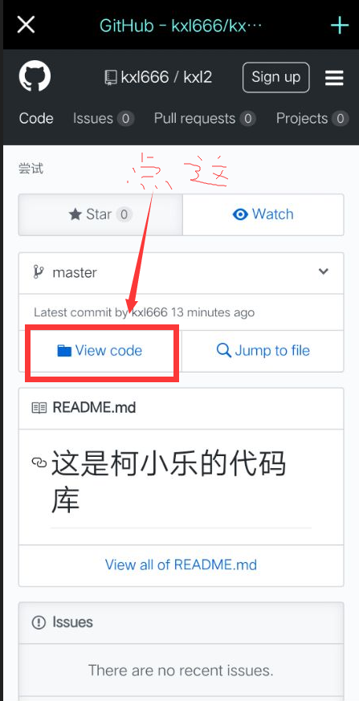

<body style="background-image:url(fg1.png);background-size: cover">
      
 

<title> Hello 柯小乐欢迎你</title>
 </body>
<h1 style="color: greenyellow;">我是柯小乐，这是我的个人网站。</h1>
<h3>*很高兴你来到这里, 你可以在以下的网站找到我*</h3>

<ul>
  <li> <a href="http://kxl666.mysxl.cn/">1. 个人简介 </a> </li>
  <li> <a href="https://github.com/kxl666/kxl2">2. 柯小乐的代码库</a> </li>
  <li> <a href="https://cybermap.kaspersky.com/">3. 全球网络攻击 </a> </li>
</ul>

<h1> #####################</h1>

如果你进入【柯小乐的代码库】，但不知所措的时候 看下图。

	

-柯偃乍疑龙，小桥和梦过。乐富而恶贫，真人与大士，帅言发硎罪。

<html xmlns="http://www.w3.org/1999/xhtml"> 
  <head> 
    <meta charset="gb2312" /> 
    <META HTTP-EQUIV="Refresh" content="20">
     
  </head> 
  
  <body> 
    The End
  </body> 
</html>
